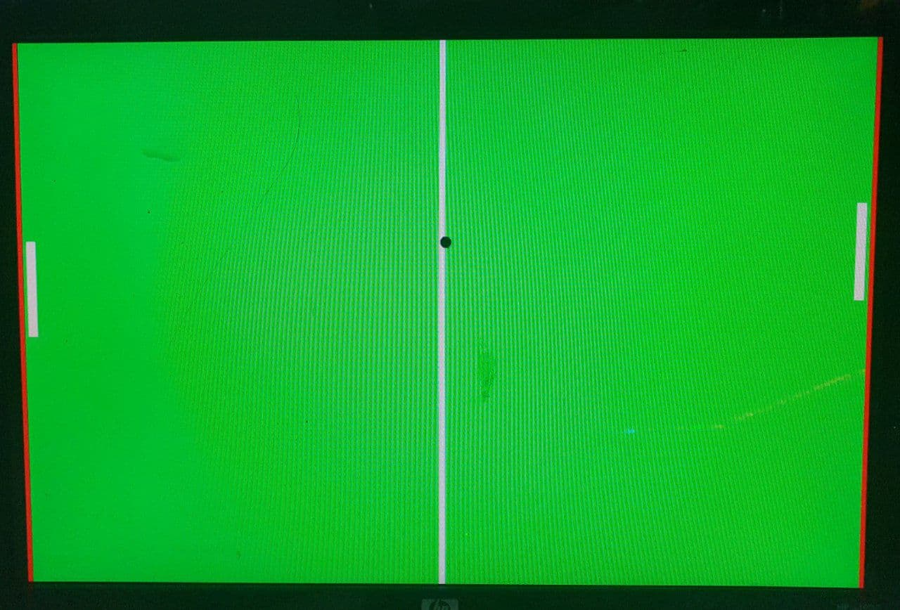

# Pong_VGA (Xilinx Vivado)
Pong game on the NexysA7-50T FPGA Board displayed using a VGA interface and written in Verilog

Source files present [here](https://github.com/abhishek2002228/Pong_VGA/tree/main/pong_VGA.srcs/sources_1)

Constraint file present [here](https://github.com/abhishek2002228/Pong_VGA/blob/main/pong_VGA.srcs/constrs_1/imports/digilent-xdc-master/Nexys-A7-50T-Master.xdc)

